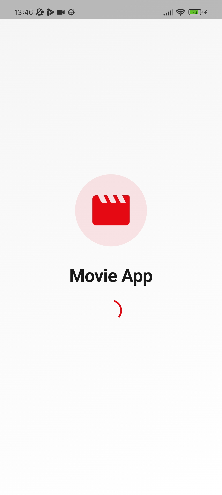
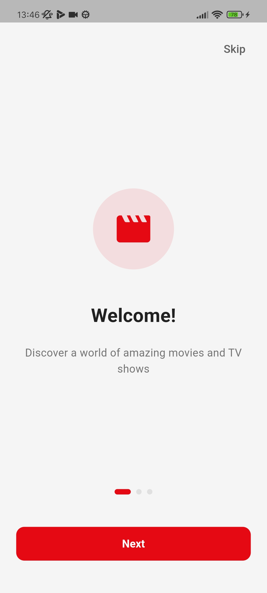
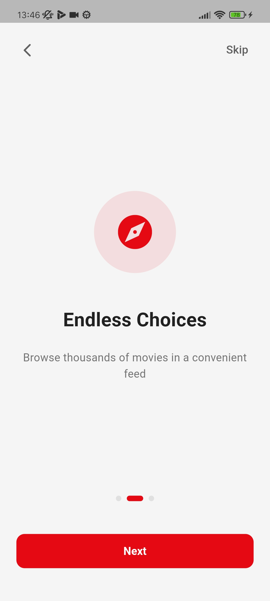
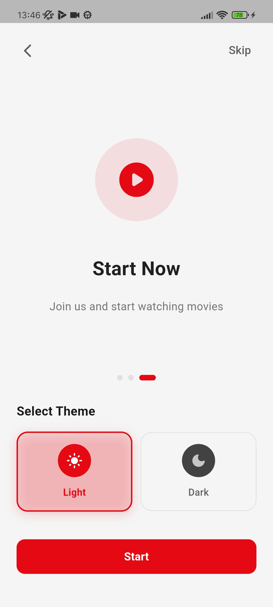
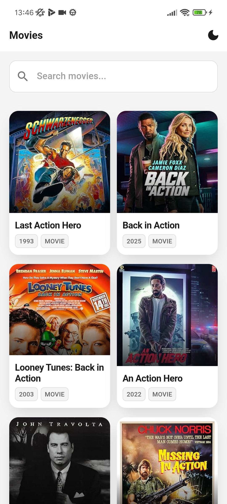
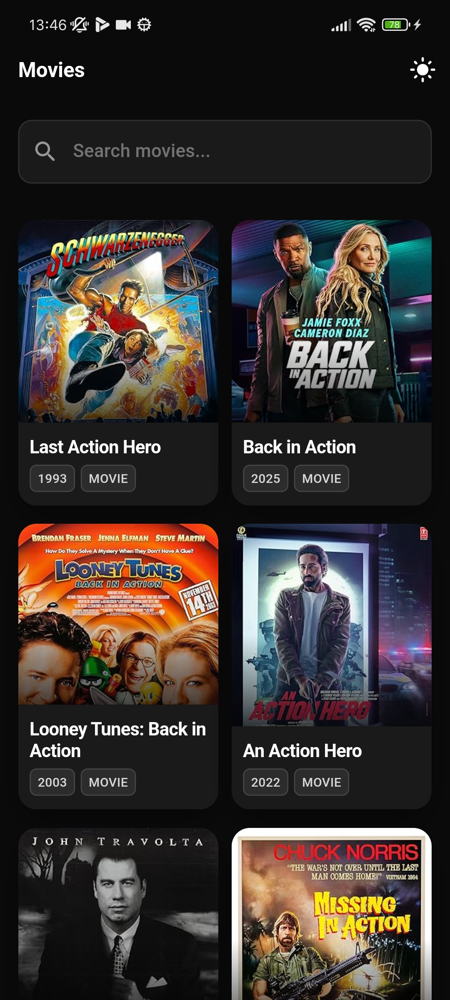

# Movie App

Мобильное приложение для поиска и просмотра информации о фильмах на Flutter.

## Описание проекта

Приложение для поиска фильмов через OMDb API с бесконечной прокруткой. Реализованы экраны: splash screen, онбординг и лента с фильмами.

### Основные возможности

- Поиск фильмов в реальном времени
- Бесконечная прокрутка с автоматической подгрузкой
- Светлая и темная тема
- Детальная информация о фильмах

## Технологии

- Flutter, Dart
- http для сетевых запросов
- Provider для управления состоянием (MVVM)
- OMDb API

## Плюсы и особенности

- **Чистый и структурированный код**: логика разделена по слоям, легко читать и поддерживать
- **Управление состоянием**: используется Provider для централизованного управления данными
- **Адаптивный дизайн**: приложение корректно работает на разных размерах экранов
- **Обработка ошибок**: понятные сообщения об ошибках с возможностью повтора запроса
- **Оптимизация**: данные подгружаются по мере прокрутки, не загружая все сразу

## Установка и запуск

1. Клонируйте репозиторий:
```bash
git clone <repository-url>
cd iteco
```

2. Установите зависимости:
```bash
flutter pub get
```

3. Запустите приложение:
```bash
flutter run
```

**Требования:** Flutter SDK 3.5.4+, эмулятор или физическое устройство.

**Примечание:** API ключ уже настроен. При необходимости можно получить бесплатный ключ на [omdbapi.com](http://www.omdbapi.com/apikey.aspx) и обновить в `lib/data/data_sources/movies_remote_data_source.dart`.

## Особенности реализации

- **Бесконечный скролл**: реализован через `ScrollController`, автоматическая подгрузка при достижении 80% прокрутки
- **Обработка ошибок**: обработка сетевых ошибок и ошибок API с возможностью повтора
- **Состояния загрузки**: индикаторы загрузки, ошибок и пустых состояний

## Скриншоты

| | | | |
|:---:|:---:|:---:|:---:|
| **Splash Screen**<br> | **Onboarding 1**<br> | **Onboarding 2**<br> | **Onboarding 3**<br> |
| **Movies Screen (Light)**<br> | **Movies Screen (Dark)**<br> | **Movie Details**<br> | **Демо видео**<br>[Видео](screenshots/Screenrecorder-2025-11-09-13-44-52-144.mp4) |

## Примечания

Вместо FakeStoreAPI используется OMDb API, так как он более подходит для работы с фильмами. Приложение поддерживает Android и iOS, реализована минимальная адаптивность для разных размеров экранов.